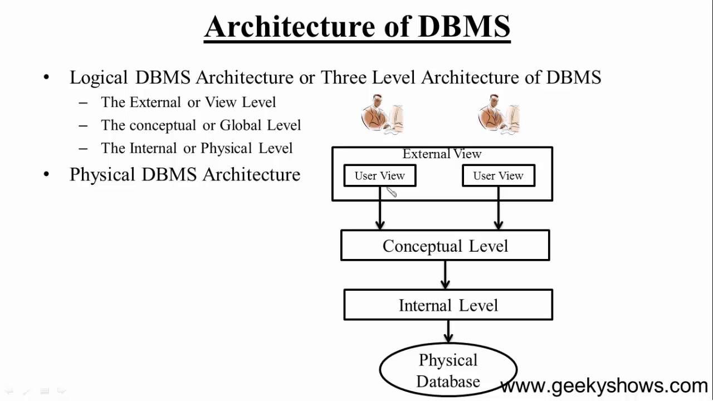

# Introduction to DBMS and RDBMS

### Introduction

### **Data:**

Any factual information in raw and disorganized form is called data.

### **Database:**

A database is a collection of related data organized in a way so that data can be easily accessed, managed and updated.

### **Database Management System:**

- A general-purpose Database Management System(DBMS) is a software system designed to allow the definition, creation, querying, updating and administration of databases.

- Well-known Database Management System's( DBMS's )include MySql,Oracle,Microsoft SQL server,Foxpro, SQLite, FileMaker Pro etc.

- The primary goal of a Database Management System(DBMS) is to provide a way to store and retrieve database information in a convenient and efficient manner.

### **Architecture of a DBMS**

### **DBMS Architecture and Data Abstraction :**

Application developers use abstraction to make the system efficient in terms of retrieval of data, and reduce complexity in terms of usability of users.

Abstraction simplifies database design and separates the applications from physical data storage.

The three layers in DBMS architecture represents three levels of abstractions :

- **Physical Level:** This is the third level ,the  physical schema of the DBMS architecture depicted in the diagram above.This is the lowest level of data abstraction. 

- **Logical Level:**  This is the middle layer of database architecture. This is the second  level, the conceptual schema  of the DBMS architecture depicted in the diagram above. This level comprises of what information is actually to be stored in the database in the form of tables. It also describes the relationship among the data entities in relatively simple structures. 

- **View Level:** This is the top most layer of the database architecture. This is the first level, the external level of the DBMS architecture depicted in the diagram above.This is the highest level of abstraction. Each user uses only a part of the actual database. This level exists to ease the accessibility of the database by an individual user. As per requirement of each individual user, multiple views of the same database may exist. Users can just view the data and interact with the database, independent of storage and implementation details of it. 

The main purpose of data abstraction is achieving data independence in order to save time and cost required when the database is modified or altered.

There are two levels of data independence achieved from these levels of abstraction :

- **Physical level data independence :** The characteristic of being able to modify the physical schema without any alterations to the conceptual or logical schema, done for optimization purposes, e.g., we can easily make any change in the storage size of the database system, without affecting the conceptual structure of the database . 

- **Logical level data independence:** The characteristic of being able to modify the logical schema without affecting the external schema or application programs. The user view of the data would not be affected by any changes to the conceptual view of the data like insertion or deletion of attributes, altering table structures entities or relationships to the logical schema etc.

### **Data Modeling**

Data model is the  logical design and structure of a database. Data model defines how data will be stored, accessed and updated in a database management system. It defines data elements and relationships among various data elements for a specified system and the constraints to maintain data integrity.

Data modeling is the process of documenting the logical design in the form of  an easily understood diagram, using text and symbols to represent the way data needs to flow. This  diagram can be used  as a blueprint for the construction of the database for applications to be developed.

For example , Entity Relationship Modelling or ER Modelling,

### **Traditional File Processing System**

A file system is a method of storing and organizing computer files and the data they contain and to make it easy to find and access them.

**Limitations of File processing System:**

- Separated and Isolated Data

- Data Redundancy

- Data Dependence

- Difficulty in representing data from the user's view

- Inflexibility in retrieving the Data

- Data Security

- Transactional Problems

- Concurrency problems

### **Need of a Database Management System**

To overcome the limitations of the traditional file processing system , the modern DBMS was created.

**Advantages of DBMS :**

- Minimal Data Redundancy

- Data Consistency

- Data Integration

- Data Sharing

- Application Development Ease

- Better Controls

- Data Independence

- Reduced Maintenance 

### **Types of DBMS**

Commonly used databases are:

- Hierarchical Database

- Network database

- Object relational database

- Relational database

### **Hierarchical DBMS:**

- In hierarchical DBMS , the relationships among data in the database are established in such a way that one data item is present as the subordinate of another one .

- The data structure "tree" is followed by the DBMS to structure the database.

### **Network DBMS:**

- In a Network DBMS  the relationships among data in the database are of type many-to-many and appears in the form of a network.

- The structure of a network database is extremely complicated because of these many-to-many relationships in which one record can be used as a key of the entire database. 

### **Object Relational Database :**

- Object Oriented DBMS add database functionality to object oriented programming languages.

- They bring much more than persistent storage of programming language objects.

- As a result, applications require less code, use more natural datamodelling, and code bases are  easier to maintain. 

### **Relational Database Management System:**

- Relational Database Management System is based on a relational model .

- Relational model is the most successfully used Data Base Management System  (DBMS) model.

- Relational model represents data in the form of tables or relations.

- Some popular examples are Oracle, Microsoft SQL Server and Microsoft Access.

### **Schema:**

The overall design or description of the database is the database schema. It represents the logical view of the entire database and defines how the data is organized and how the relations among them are associated along with formulation of all the constraints that are to be applied on the data to retain data consistency and integrity.

For example the design of the tables for an entire application or project.

**Schema is of two types:**

- **Physical schema:** It is the design of a database at its physical level. In this level, it is expressed how data is stored in blocks of storage.

- **Logical schema:** It is the design of the database at its logical level. At this level, data is described as certain types of data records that can be stored in the form of data structures without having the implementation details of it. 

### **Instance:**

It is the data stored in database at a particular moment of time. It is the information collected in a database at some specific moment. 

## RDBMS terminologies

### **Relation:**

A relation is a collection of related data entries  consists of columns and rows.

### **Tuple:**

A tuple, also called a row of data, is each individual entry that exists in a table.

### **Fields:**

- Every table is broken up into smaller entities called fields.

- A field is a column in a table that is designed to maintain specific information about every record in the table.

### **Keys in DBMS**

Keys are used to establish and identify relation between tables.

**Super Key:**

A Super key is any combination of fields within a table that uniquely identifies each record within that table.

**Candidate Key:**

- A candidate key is a subset of a super key.

- A candidate key may be a single field or the least combination of fields that uniquely identifies each record in the table.

- The least combination of fields distinguishes a candidate key from a super key.

**Primary key:**

- A primary key is a candidate key that is most appropriate to be the main reference key for the table.

- It is a key that uniquely identifies a record in a table.

**Foreign key:**

- A foreign key is the field in a table that generally references values from primary key field of other table
